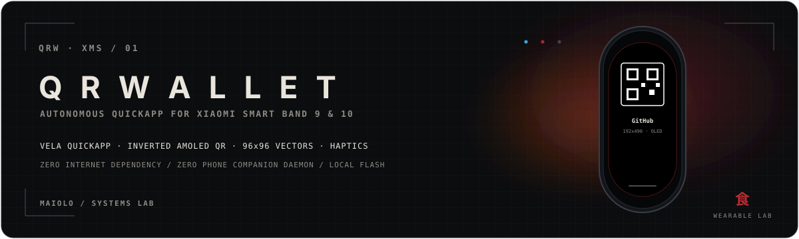
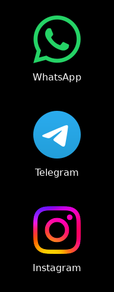
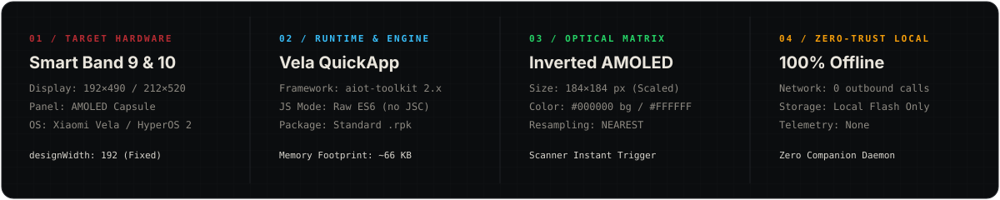
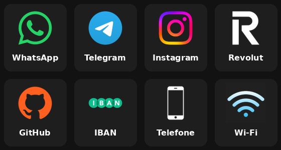

# QRWallet

<p align="center">
  
</p>

<p align="center">
  <sub><strong>VELA QUICKAPP · AMOLED · MATRIZ ÓPTICA DE HARDWARE · HYPEROS · HÁPTICA</strong></sub>
</p>

<p align="center">
  🇵🇹 <strong>Português</strong>
  · <a href="README.md">🇬🇧 English</a>
  · <a href="README.es.md">🇪🇸 Español</a>
  · <a href="README.zh.md">🇨🇳 简体中文</a>
  · <a href="README.ru.md">🇷🇺 Русский</a>
</p>

> **Carteira autônoma de QR Codes e atalhos rápidos para Xiaomi Smart Band 9 e Smart Band 10 (Xiaomi Vela / HyperOS).**  
> Acesso direto às suas credenciais digitais essenciais (WhatsApp, Telegram, Instagram, Revolut, GitHub, IBAN, Discador telefônico e Acesso Wi-Fi) renderizadas como QR codes invertidos de nível óptico para telas AMOLED direto no seu pulso. Zero dependência de internet. Zero daemon em segundo plano no celular.

<p align="center">
  
</p>

---

## 01 / VISÃO GERAL (AT A GLANCE)

<p align="center">
  
</p>

---

## 02 / CAPACIDADES

### Destaques Arquiteturais

- **100% Autônomo na Pulseira**: Executa nativamente no motor QuickApp do Xiaomi Vela no microcontrolador da pulseira. Nenhum aplicativo precisa ficar aberto no celular e não requer conexão de dados durante o uso.
- **Óptica Invertida para AMOLED**: QR codes convencionais com fundo branco causam reflexo e ofuscamento em telas vestíveis. O QRWallet utiliza fundo preto puro `#000000` com módulos brancos `#FFFFFF`, maximizando a autonomia da bateria OLED e acionando câmeras de celulares (Google Lens, iPhone, apps bancários) instantaneamente.
- **Densidade Ergonômica Nativa**: Calibrado com `height: 160px` por cartão, exibindo com precisão exatamente 3 itens por tela no display de 490px/520px sem cortes desajeitados.
- **Glifos Vetoriais Genuínos**: Ícones de alta fidelidade em 96×96 px combinados com a tipografia nativa `MiSans` (renderizada em 24px com peso normal, sem deformação de falso negrito).
- **Confirmação Háptica**: Pulsos de microvibração ao tocar em um atalho e ao deslizar para voltar.
- **Estabilidade Sem Bytecode**: Empacotado estritamente como JavaScript ES6 padrão. Evita a flag `--enable-jsc` que causa travamento em tela preta no HyperOS 2 / Band 10.

---

## 03 / ANATOMIA ÓPTICA E DE TELA

<p align="center">
  
</p>

<details>
<summary><strong>Especificações Técnicas de Hardware e Matriz Óptica</strong></summary>

| Parâmetro | Especificação | Objetivo / Racional |
| :--- | :--- | :--- |
| **Dispositivos Alvo** | Xiaomi Smart Band 9 e 10 | Formato de cápsula OLED |
| **Resolução Virtual** | `192 × 490` (`designWidth: 192`) | Elimina distorções de arredondamento em ponto flutuante |
| **Ritmo da Lista** | `height: 160px` | 3 cartões visíveis por viewport (`490 / 160 ≈ 3.06`) |
| **Geometria dos Ícones** | `96 × 96 px` RGBA PNG | Dimensão padrão nativa de ativos |
| **Tipografia** | `MiSans`, `24px`, `font-weight: normal` | Fonte vetorial nativa do sistema; evita bordas pixeladas |
| **Quadro do QR Code** | `184 × 184 px` (`margin: 1`) | Preenche a largura preservando a borda de respiro |
| **Modelo de Cor** | Frente `#FFFFFF` / Fundo `#000000` | Matriz óptica de alto contraste para AMOLED |
| **Interpolação** | `NEAREST` (Vizinho mais próximo) | Módulos quadrados nítidos sem borrão |

</details>

---

## 04 / INSTALAÇÃO

### Via Notify for Xiaomi (Recomendado)

1. Baixe o pacote compilado mais recente em **[Releases](https://github.com/mastermaiolo/QRWallet/releases)** (`com.custom.qrwallet.release.1.0.0.rpk`).
2. Transfira o arquivo `.rpk` para o seu telemóvel.
3. Abra o **Notify for Xiaomi** → Vá em **Definições / Dispositivo** → **Aplicativo de terceiros**.
4. Toque em **Carregar arquivo .rpk** e selecione o pacote.
5. Aguarde o envio Bluetooth concluir.

> [!IMPORTANT]
> **Regra de Invalidação de Cache**: Se você já tiver uma versão anterior instalada na pulseira, **desinstale-a primeiro** pelo Notify ou pelo menu de apps do relógio antes de enviar a nova versão. Isso força o Xiaomi Vela a limpar os ícones antigos da memória flash.

### Via Mi Fitness Modificado (Developer Menu)

1. Abra o app Mi Fitness modificado no smartphone pareado.
2. Acesse a tela de depuração oculta (`ThirdAppDebugFragment`).
3. Digite o package name: `com.custom.qrwallet`.
4. Toque em **Install third app** e selecione o arquivo `.rpk`.

---

## 05 / CUSTOMIZAÇÃO POR INTELIGÊNCIA ARTIFICIAL

Como nem o Notify nem o Mi Fitness possuem interface gráfica para editar arquivos de QuickApps no celular, **todas as credenciais e imagens são compiladas diretamente no binário `.rpk`**.

Para personalizar este repositório com seus dados em poucos segundos, utilize o arquivo **[`AI_CUSTOMIZATION_PROMPT.md`](./AI_CUSTOMIZATION_PROMPT.md)**.

<details>
<summary><strong>Template do Prompt para IA (Copiar e Colar)</strong></summary>

Copie o bloco abaixo e envie para qualquer IA (**ChatGPT, Claude, Gemini, Antigravity, Cursor**):

```text
Você é um desenvolvedor especialista no framework Xiaomi Vela QuickApp (para Xiaomi Smart Band 9 e 10).
Eu tenho o projeto "QRWallet" e quero customizar os atalhos, ícones e QR Codes com os meus dados:

Meus Dados:
- WhatsApp: [https://wa.me/351912345678]
- Telegram: [https://t.me/seunome]
- Instagram: [https://instagram.com/seunome]
- Revolut: [https://revolut.me/seunome]
- GitHub: [https://github.com/seunome]
- IBAN: [PT50000000000000000000000]
- Telefone: [tel:+351912345678]
- Wi-Fi: [WIFI:S:NomeDaRede;T:WPA;P:SenhaSecreta;;]

Restrições Técnicas:
1. QR Codes: 184x184 px, modo escuro invertido (fundo #000000, módulos #FFFFFF), margem=1, interpolação NEAREST, salvos em src/common/qrcodes/<nome>_dark.png.
2. Ícones: 96x96 px RGBA PNG, salvos em src/common/icons/<nome>.png.
3. Layout: height: 160px, font-size: 24px, font-weight: normal (MiSans).
4. Compilação: npm run release (sem --enable-jsc). Incremente o versionCode no manifest.json.
```

</details>

---

## 06 / AUTOMAÇÃO LOCAL (TERMINAL)

Para gerar localmente sem depender de interfaces de chat:

```bash
# 1. Edite suas credenciais em generate_assets.py
nano generate_assets.py

# 2. Execute o gerador automático (gera QR codes + converte SVGs)
python3 generate_assets.py

# 3. Compile o pacote de produção
npm run release
```

O pacote `.rpk` final estará pronto em:  
`dist/com.custom.qrwallet.release.1.0.0.rpk`

---

## 07 / ARQUITETURA DE ARQUIVOS

```text
QRWallet/
├── AI_CUSTOMIZATION_PROMPT.md    # Instruções prontas para IA
├── generate_assets.py            # Pipeline de automação (qrencode + Pillow + rsvg)
├── icon/                         # Vetores SVG originais (96x96)
├── icon2.png                     # Ícone mestre do launcher (128x128)
├── package.json                  # Scripts de build (aiot-toolkit 2.x)
├── sign/                         # Chaves de assinatura de Debug e Release
└── src/
    ├── manifest.json             # Definição do app (permissões, designWidth: 192)
    ├── app.ux                    # Controlador de ciclo de vida
    ├── common/
    │   ├── icons/                # Ícones PNG de 96x96 px
    │   ├── qrcodes/              # QR codes invertidos de 184x184 px para AMOLED
    │   └── logo.png              # Emblema da carteira para a lista de apps
    └── pages/
        ├── index/index.ux        # Lista principal de cartões (160px)
        └── qrcode/qrcode.ux      # Visualizador AMOLED em tela cheia com vibração
```

---

## 08 / RESOLUÇÃO DE PROBLEMAS

| Sintoma | Causa | Solução |
| :--- | :--- | :--- |
| **Tela preta ao abrir o app** | Compilação com bytecode ativada | Certifique-se de que `--enable-jsc` está desligado (`false`). |
| **Ícones antigos continuam aparecendo** | Cache da memória flash da pulseira | Desinstale o aplicativo da pulseira antes de enviar a nova versão. |
| **Texto com contorno grosso/pixelado** | Falso negrito no CSS | Use `font-weight: normal; font-size: 24px;`. Nunca use `font-weight: bold`. |
| **Leitor do celular não reconhece o QR** | Resolução inadequada ou fundo claro | Mantenha 184×184 com interpolação `NEAREST` e fundo `#000000`. |

---

## 09 / CRÉDITOS E LICENÇA

- **Autor / Arquitetura de Sistemas**: [mastermaiolo](https://github.com/mastermaiolo)
- **Assinatura do Estúdio**: **MAIOLO / SYSTEMS LAB** · **食**
- **Licença**: [MIT](LICENSE) — Livre para customização pessoal e distribuição.
